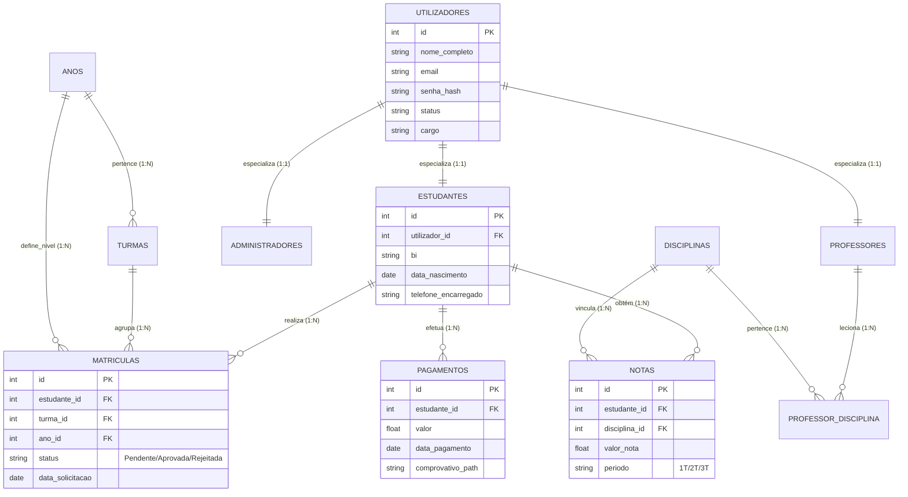

# Modelagem de Dados e Comportamento: Sistema GHS

Este documento detalha a estrutura lógica da base de dados e as interações dos utilizadores com a plataforma.

---

## 1. Modelo Entidade-Relacionamento (MER)

O sistema utiliza uma arquitetura de base de dados relacional com especialização técnica da entidade `Utilizadores`.



---

## 2. Diagrama de Casos de Uso (UML)

Descreve as principais interações de cada ator com o sistema.

```mermaid
useCaseDiagram
    actor "Administrador" as admin
    actor "Estudante" as est
    actor "Professor" as prof
    actor "Sistema" as sys

    package "Portal Académico GHS" {
        usecase "Validar Matrícula" as UC1
        usecase "Gerir Turmas e Disciplinas" as UC2
        usecase "Visualizar Dashboard Financeiro" as UC3
        usecase "Lançar Notas" as UC4
        usecase "Consultar Histórico Escolar" as UC5
        usecase "Submeter Comprovativo de Pagamento" as UC6
        usecase "Emitir Recibo PDF" as UC7
    }

    admin --> UC1
    admin --> UC2
    admin --> UC3
    
    prof --> UC4
    prof --> UC5
    
    est --> UC5
    est --> UC6
    
    UC1 ..> UC7 : <<include>>
    UC6 ..> sys : "Gera Alerta Admin"
    sys --> UC7 : "Automação"
```

---

## 3. Descrição dos Atores e Fluxos

### 3.1 Administrador
*   **Responsabilidade:** Guardião da integridade dos dados e fluxo financeiro.
*   **Ação Crítica:** Aprovação de matrículas. Quando o admin aprova uma matrícula (RF003), o sistema dispara automaticamente a criação da instância académica do aluno e permite o seu acesso total ao portal.

### 3.2 Estudante
*   **Responsabilidade:** Utilizador final dos serviços académicos.
*   **Ação Crítica:** Submissão de dados biográficos. O estudante inicia o ciclo de vida do software no momento do registo pendente.

### 3.3 Professor
*   **Responsabilidade:** Gestor pedagógico.
*   **Ação Crítica:** Lançamento de avaliações. Alimenta a tabela `notas`, que por sua vez gera o feedback visual para alunos e administradores no dashboard.

### 3.4 Sistema (Agente Autónomo)
*   **Responsabilidade:** Automação de processos secundários.
*   **Ação Crítica:** Geração de PDFs de recibos e certificados, garantindo que o documento segue o padrão institucional sem necessidade de intervenção humana manual.

---

## 4. Dicionário de Dados Resumido

| Entidade | Descrição | Importância Técnica |
| :--- | :--- | :--- |
| **Utilizadores** | Tabela de autenticação central. | Única fonte de verdade para Login (Zero-Trust). |
| **Matrículas** | Estado dinâmico do aluno no sistema. | Controla permissões de visibilidade de módulos (ACL). |
| **Pagamentos** | Rastreabilidade financeira. | Base para o cálculo de ROI e saúde financeira da escola nos gráficos do dashboard. |

---

## 5. Análise Detalhada de Cardinalidades

Abaixo estão as justificações técnicas para as cardinalidades aplicadas ao sistema GHS:

### 5.1 Utilizadores (1:1) Estudantes / Professores
*   **Tipo:** Especialização (1 para 1).
*   **Justificação:** Cada `Estudante` ou `Professor` deve possuir obrigatoriamente apenas uma conta de `Utilizador`. Isto garante que as credenciais de segurança estejam isoladas dos dados biográficos, facilitando auditorias de acesso.

### 5.2 Estudantes (1:N) Matrículas
*   **Tipo:** 1 para Muitos.
*   **Justificação:** Um único `Estudante` pode realizar múltiplas `Matrículas` ao longo da sua vida académica (uma para cada ano letivo). No entanto, cada registo de matrícula pertence a um único aluno exclusivo.

### 5.3 Turmas (1:N) Matrículas
*   **Tipo:** 1 para Muitos.
*   **Justificação:** Uma `Turma` comporta vários alunos (muitas matrículas), mas cada `Matrícula` específica de um aluno em um determinado ano só pode estar vinculada a uma única turma por vez.

### 5.4 Professores (N:N) Disciplinas
*   **Tipo:** Muitos para Muitos (Resolvido com tabela associativa `professor_disciplina`).
*   **Justificação:** Um `Professor` pode lecionar várias `Disciplinas`, e uma `Disciplina` pode ter múltiplos `Professores` (ex: diferentes turmas ou turnos).

---

## 6. Integridade Referencial e Normas
O MER do sistema GHS segue rigorosamente a **3ª Forma Normal (3FN)**, eliminando redundâncias de dados e garantindo que cada facto seja armazenado em um único lugar. As cardinalidades asseguram que a integridade dos dados financeiros e académicos seja mantida através de chaves estrangeiras (`Foreign Keys`) com restrições de integridade.
