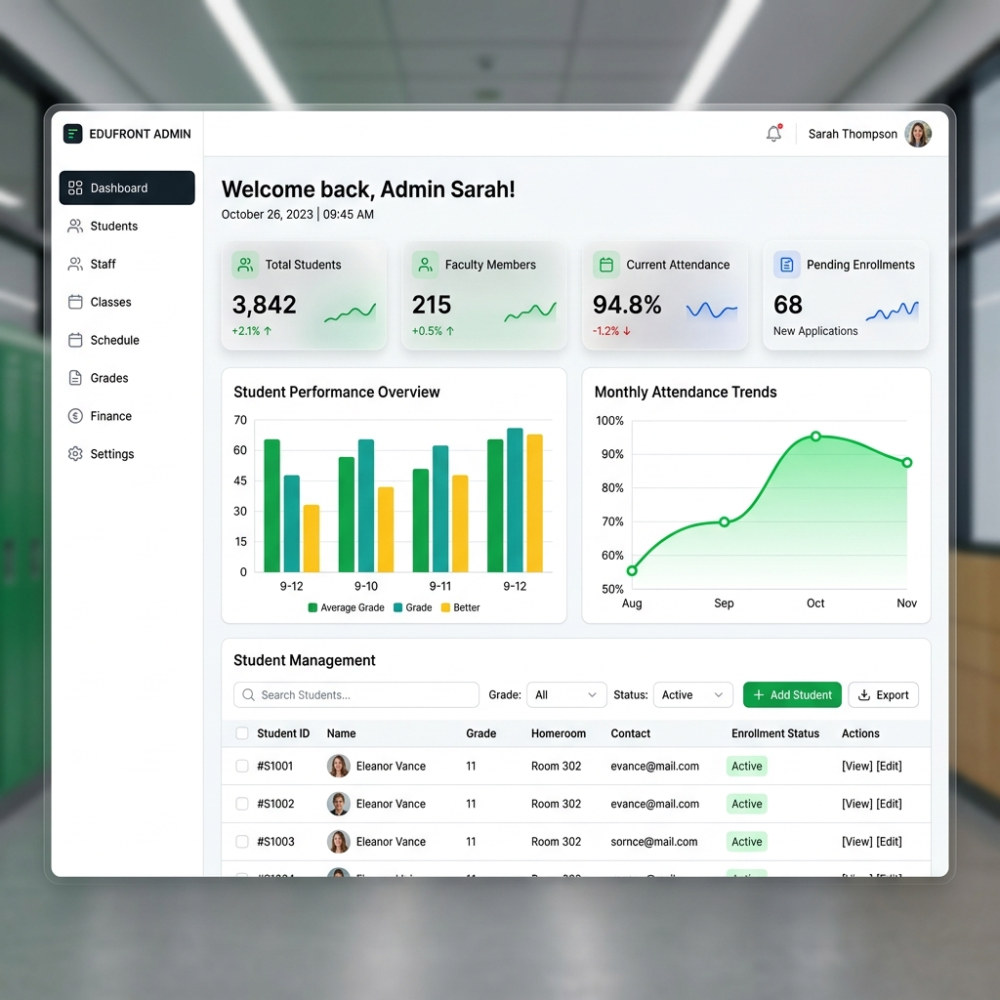
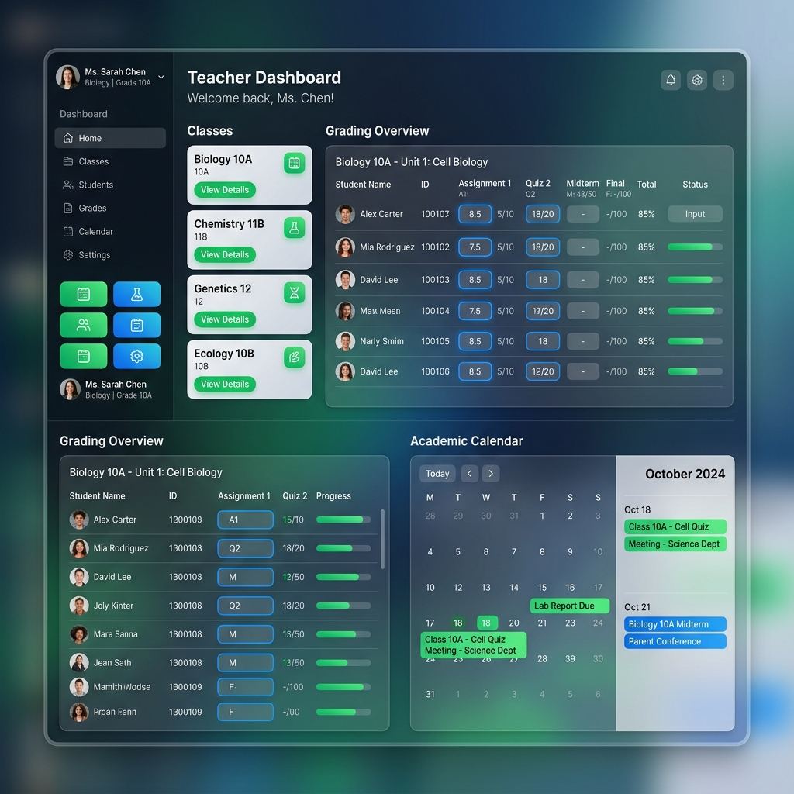
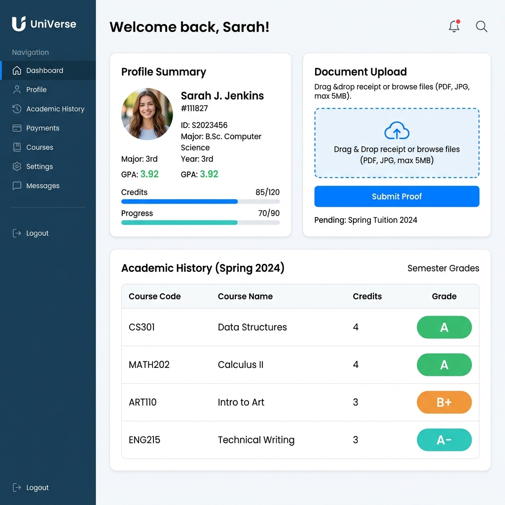

# Manual do Utilizador: Green Hard & Softh (GHS)

Bem-vindo à plataforma escolar GHS! Abaixo encontra-se o guia passo-a-passo detalhado — e visualmente guiado — para cada perfil de acesso na instituição:

## 1. Para o Administrador Escolar (`/admin`)

O painel de Administrador é a torre de controlo do seu sistema escolar. Toda a gestão estratégica, matrículas e validações cruciais acontecem aqui.

- **Dashboard Principal**: Visualize num relance estatísticas rápidas — total de matrículas atuais, relatórios de caixa diários, etc. Utilize gráficos em anel e linhas para métricas de progresso com uma estética limpa.
- **Gestão de Estudantes**: No separador de gerir estudantes, ative ou desative matrículas usando a tabela de ações. O Administrador pode também forçar redefinição de palavras-passe para alunos sem acesso, definindo a password padrão `123456` temporariamente.
- **Secretaria/Tesouraria Integrada**: Confirme os pagamentos submetidos. Analise o documento de pagamento, comprove o valor no extrato e clique em "Validar Receção" para remover as restrições bloqueantes do aluno no sistema online do mesmo.
- **Calendário Letivo e Feriados**: Adicione Eventos Globais. Basta escolher a cor do indicador visual, as **Datas de e até** e o Público-Alvo (Apenas Professores ou Total). O evento irá refletir automaticamente sem spam duplicado nas pautas de todos.

---

## 2. Para o Professor (`/professor`)

O portal do professor foi concebido sem barreiras tecnológicas, desenhado com *glassmorphism* e estética relaxante para reduzir a fadiga do trabalho de rotina e introdução de pautas.

- **Lista de Turmas e Disciplinas**: No seu painel lateral tem acesso às turmas pelas quais é responsável pedagógico (ex: Física-10ºA, TIC-5ºB).
- **Lançamento Rápido de Notas**: Ao abrir uma disciplina, a grelha apresenta listas nominais de alunos. Insira a "Nota 1" e "Nota 2" diretamente. O cálculo "Aprovado" vs. "Recurso" é matemático, dinâmico e salva instantaneamente (através de tecnologia AJAX, prevenindo a recarga constante da janela).
- **Gestão de Ficheiros Eletrónicos**: Precisa de enviar um PowerPoint ou PDF a uma Turma? Dirija-se ao separador de Anexos, introduza o Titulo, selecione um ficheiro de até 20MB, e faça "Upload". Tudo rastreado por sistema "MIME" para a segurança cibernética global.
- **Calendário Pessoal**: Eventos letivos (Testes ou Projetos da sua responsabilidade) misturam-se gentilmente com os Feriados Oficiais que bloqueiam avaliações nessas datas.

---

## 3. Para o Aluno (`/estudante`)

Pensado e otimizado para utilizadores maioritariamente nativos da plataforma móvel ou computadores dinâmicos, o portal do Aluno é um ecrã intuitivo.

- **Painel de Pagamentos**: Acabaram as filas à chuva fora da Tesouraria. Tem em mãos um formulário encriptado antifraude e rápido. Fotografe ou anexe o talão do seu Banco, escolha o serviço pago e faça *"Submeter"*. Acompanhe ali mesmo o sinal "Em Análise" até que o tesoureiro aprove a transação (em poucas horas).
- **Consultas Pedagógicas Célere**: A sua tabela de aproveitamento emite "Distinções Verdes" (Positiva) ou Alertas Vermelhos (Negativa). Encontrou algum erro na pauta? Prima o botão de interrogação "Recorrer" perante a diretoria, o Professor receberá um alerta oficial.
- **Histórico Global Académico**: A novidade de 2026! Um rastreador completo — semelhante ao seu currículo de aptidões finais. O sistema aglutina todos os anos que operou na Green Hard & Softh para prova final perante qualquer entidade oficial em exames de certificação.

*Notas de Recuperação e Manutenção*: A plataforma é altamente resiliente. Se ocorrer um "Erro 500", verifique primariamente se não anexou fotografias maiores que **20MB** no seu perfil, uma das regras máximas do Servidor Central GHS.
